<Eyebrow>BGRS/SB-2026</Eyebrow>

# Representation-independent comparison of transcription factor motifs

Anton V. Tsukanov, PhD (Biology) &middot; Victor G. Levitsky, PhD (Biology)

Institute of Cytology and Genetics SB RAS, Novosibirsk, Russia

<!--
Good morning. My name is Anton Tsukanov.
Today I will present MIMOSA, a method for representation-independent comparison of transcription factor motifs.
The main idea is simple: instead of comparing internal parameters of motif models, we compare how these models recognize DNA sequences.
-->

---
layout: two-cols-header
---

## Why transcription factor motifs matter

::left::

- Transcription factors (TFs) bind specific DNA sites and interact with the transcriptional complex1
- TFs control gene expression programs.
- One TF can bind to a range of similar DNA sequences.
- A **motif** captures sequence variation across these binding sites.2

::right::

<Callout>
Motifs let us predict transcription factor binding sites (TFBSs) in the genome, which makes it possible to study transcription regulation.2
</Callout>

<!--
Let me start from the biological context.
Transcription factors bind short DNA sites and regulate gene expression.
These sites are not identical, but they are similar.
A motif summarizes this variation and helps us predict transcription factor binding sites in the genome.
This prediction is one of the basic steps in studying transcription regulation.
-->

---
clicks: 6
---

## Position weight matrix: the standard motif model

  <section class="card pwm-standard-copy">
    <ul class="pwm-theses">
      <li>A PWM is built from aligned binding sites and scores candidate sites as a sum of position-specific contributions3</li>
      <li v-click="4">PWMs remain the de facto standard for motif representation and analysis3</li>
      <li v-click="5">However, real TF binding can involve dependencies between motif positions, so some binding sites may be poorly captured by PWM alone4,5</li>
    </ul>
  </section>

   <PWMAnimation :step="$clicks" /> 

  <Note v-click="6" class="pwm-standard-note">
      The position-independence assumption may not always be valid
  </Note>

<!--
The most common motif representation is the position weight matrix, or PWM.
A PWM is easy to interpret: each position contributes separately to the score of a candidate site, and these contributions are summed.

[click] In the animation, we move from aligned binding sites to position-specific nucleotide preferences.

[click] Then these preferences can be used to score a new sequence.

[click] This simplicity is why PWMs remain the standard representation in many databases and tools.

[click] But real transcription factor binding can include dependencies between positions.

[click] So the position-independence assumption may be too restrictive for some motifs.
-->

---

## Sources of positional dependencies

<CardGrid :columns="3" class="card-grid-size-45-28-28 card-grid-bottom-media">
    <Card title="Dimerization">
        
A partner TF can influence binding affinity at TFBSs.6

        
    </Card>
    <Card title="Flanks">
        
Flanking regions can either increase or decrease affinity for the same binding site.7

        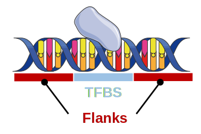
    </Card>
    <Card title="Conformation">
        
Some TFs can bind sites that differ substantially from the canonical motif.8

        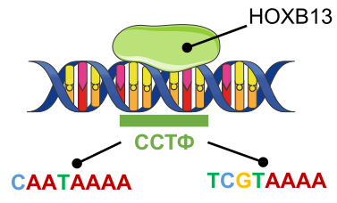
    </Card>
</CardGrid>

<Note>
Models such as BaMM9, Slim10 and DIMONT11 preserve such dependencies instead of flattening them into a single matrix.
</Note>

<!--
Why can positions depend on each other?
There are several biological reasons.
Dimerization can change the sequence preference of a transcription factor.
Flanking regions can increase or decrease binding affinity for the same core site.
Protein-DNA conformation can also allow sites that differ from the canonical motif.
Alternative models, such as BaMM, Slim, and DIMONT, try to keep this information instead of flattening it into one independent matrix.
-->

---

## From binding data to TF annotation

  

    <section v-click="1" class="card" data-id="card-1">
      <h3>1 &middot; Experimental data</h3>
      
Read preprocessing and sequence extraction

      
In vitro

      

        HT-SELEX
        DAP-seq
      

      
In vivo

      

        ChIP-seq
        CUT&amp;Tag
      

    </section>
    <section v-click="2" class="card" data-id="card-2">
      <h3>2 &middot; <em>de novo</em> motif discovery</h3>
      
Search for overrepresented sequence patterns

      
Tools

      

        STREME
        MEME
        HOMER
      

      

        BaMM
        Slim
        DIMONT
        SiteGA
      

    </section>
    <section
      v-click="3"
      v-mark="{ at: 4, type: 'box', color: 'var(--hot)' }"
      class="card"
      data-id="card-3"
    >
      <h3>3 &middot; Annotation</h3>
      
Match the <em>de novo</em> motif to known motifs from HOCOMOCO, JASPAR or CIS-BP

      
Tools

      

        Tomtom
        STAMP
        MACRO-APE
      

    </section>
    

      PWM motif model
      Alternative motif model
    

  

<FancyArrow
  v-click="2"
  from="[data-id=card-1]@(170,0)"
  to="[data-id=card-2]@(160,0)"
  color="var(--primary)"
  :width="3"
  :head-size="22"
  :roughness="1"
  :arc="0.2"
  :duration="500"
>
  sequences
</FancyArrow>

<FancyArrow
  v-click="3"
  from="[data-id=card-2]@top"
  to="[data-id=card-3]@top"
  color="var(--primary)"
  :width="3"
  :head-size="22"
  :roughness="1"
  :arc="0.2"
  :duration="500"
>
  motifs
</FancyArrow>

<FancyArrow
  v-click="5"
  from="[data-id=card-3]@bottom"
  to="[data-id=bottleneck-note]@(800,0)"
  color="var(--primary)"
  :width="3"
  :head-size="22"
  :roughness="1"
  :arc="-0.2"
  :duration="600"
/>

<Note v-click="5" data-id="bottleneck-note">
  Most established annotation tools are designed for PWM/PFM motif models, not alternative motif models.12-14 Non-PWM models often have to be converted before annotation.
</Note>

<!--
Now let us look at the usual workflow from binding data to motif annotation.

[click] First, we start with experimental data, for example HT-SELEX, DAP-seq, ChIP-seq, or CUT&Tag.
The data are processed, and DNA sequences are extracted.

[click] Then we run de novo motif discovery.
Some tools produce PWM models, while other tools produce alternative motif models.

[click] Finally, we need annotation: which known transcription factor motif is closest to our discovered motif?

[click] This annotation step is the bottleneck for non-PWM models.

[click] Most established annotation tools are designed for PWM or PFM motif models.
So alternative models often have to be converted before annotation, and this conversion can lose useful information.
-->

---
layout: section
class: section-divider
---

<Eyebrow>MIMOSA idea</Eyebrow>

# Compare model **behavior**, not model parameters

<!--
This is the central idea of MIMOSA.
Different motif models can have very different internal parameters.
So direct parameter comparison is not always meaningful.
Instead, we compare behavior: do two models recognize the same DNA positions with similar scores?
-->

---
clicks: 5
---

## Recognition-profile comparison

  <section class="card mimosa-method-copy">
    <ol class="mimosa-method-steps">
      <li>Scan the same sequence set with both motifs (<i>Motif 1</i>, <i>Motif 2</i>)</li>
      <li v-click="1">Obtain two score profiles: Profile 1 and Profile 2</li>
      <li v-click="2">Calibrate each profile to -log10(ERR)15</li>
      <li v-click="3">Find anchor positions above the threshold on <i>Profile 1</i> and extract local windows</li>
      <li v-click="4">Shift <i>Profile 2</i> relative to <i>Profile 1</i> and compute a similarity score within each window</li>
    </ol>
  </section>

  <MimosaAlgorithmSteps :step="Math.min($clicks + 1, 5)" />

<Note v-click="5" class="mimosa-method-note">
MIMOSA reports the strand and shift where the
similarity score is maximized
across local profile windows
</Note>

<!--
For a pair of motifs, MIMOSA scans the same sequence set with both models.

[click] This gives two recognition profiles: one profile for each motif.

[click] Raw scores from different models are not directly comparable, so each profile is calibrated to negative log ERR.
This puts different score scales into one common coordinate system.

[click] Then MIMOSA selects anchor positions with strong signal and extracts local windows around them.

[click] The second profile is shifted relative to the first profile, and both strands are checked.
For every shift, MIMOSA computes a similarity score inside the local windows.

[click] The final result is the strand and shift where the similarity is maximal.
-->

---

## Similarity metrics used in MIMOSA

<CardGrid :columns="2">
  <Card title="Cosine">

  $$
  S_{\cos}(x,y)=\frac{x \cdot y}{||x||\,||y||}
  $$

  Compares profile shape.16

  </Card>
  <Card title="Dice">

  $$
  S_{\mathrm{Dice}}(x,y)=\frac{2\sum_i \min(x_i,y_i)}{\sum_i x_i+\sum_i y_i}
  $$

  Compares profile overlap.16

  </Card>
</CardGrid>

<Note>
Interpretation: a high, statistically significant score indicates similar recognition behavior, not necessarily identical parameters.
</Note>

<!--
MIMOSA currently uses two similarity metrics.
Cosine similarity mainly compares the shape of the score profiles.
If the peaks appear at the same positions, cosine becomes high.
Dice similarity focuses more on overlap of signal intensity.
In both cases, a high and statistically significant score means similar recognition behavior.
It does not mean that the internal parameters of the models are identical.
-->

---
layout: section
class: section-divider
---

<Eyebrow>Benchmark against established tools</Eyebrow>

# Does it work as a retrieval method?

<!--
After defining the method, we need to test whether it works for motif annotation.
The benchmark question is a retrieval question.
If I use one motif as a query, can the method place the corresponding transcription factor motif near the top of the ranked list?
-->

---
layout: two-cols-header
class: benchmark-design-slide
---

## Benchmark design

::left::

<Callout>
Does the method rank the corresponding TF motif near the top?
</Callout>

::right::

- HOCOMOCO v14 mouse motifs17
- Matched _in vitro_ and _in vivo_ motif collections for TFs present in both sets
- Correct hit = target motif with the same TF annotation
- Metric evaluated within each Wingender class independently (at least 10 motifs per class)18
- Matched motifs per collection: 1,115
- Metrics: MRR, Recall@k
- Tools: Tomtom12, STAMP13, MACRO-APE14, MoSBAT19

<!--
For the benchmark, we used HOCOMOCO mouse motifs.
In vitro motifs were used as queries, and in vivo motifs were used as targets.
A hit was correct if the target motif had the same transcription factor annotation as the query.
The metrics were calculated inside Wingender transcription factor classes, so we did not mix very different DNA-binding families.
In total, there were 1,115 matched motifs in each collection.
We compared MIMOSA with Tomtom, STAMP, MACRO-APE, and MoSBAT.
-->

---

## Metrics for tool comparison

<CardGrid :columns="2" style="margin-bottom: 24px">
  <Card title="MRR">

  $$
  \mathrm{MRR}=\frac{1}{|Q|}\sum_{q \in Q}\frac{1}{r_q}
  $$

  Mean reciprocal rank: rewards placing the first correct motif as high as possible.

  </Card>
  <Card title="Recall@k">

  $$
  \mathrm{Recall@}k=\frac{1}{|Q|}\sum_{q \in Q}\mathbf{1}\{r_q \le k\}
  $$

  Fraction of queries where a correct motif appears within the top $k$ results.

  </Card>
</CardGrid>

$Q$ is the query motif set; $r_q$ is the rank of the first target motif annotated to the same TF as query $q$.

<!--
We used two standard ranking metrics.
MRR, or mean reciprocal rank, is sensitive to the position of the first correct hit.
Rank one gives a score of one, rank two gives one half, and so on.
Recall at k asks a simpler question: is the correct motif present among the top k results?
Recall at five is close to practical use, because a researcher often checks several top candidates.
-->

---
clicks: 4
---

## Benchmark results

<FigurePanel
  src="assets/compare_tools_by_metrics.svg"
  alt="Benchmark metrics comparing MIMOSA with established motif-comparison tools"
  variant="wide"
/>

<FancyArrow
  v-if="$clicks === 1"
  from="(770, 380)"
  to="(645,300)"
  color="red"
  :width="3"
  :head-size="22"
  :roughness="1"
  :arc="-0.2"
  :duration="600"
/>

    One TF class

    MIMOSA is comparable to established tools in MRR

    MIMOSA is comparable to established tools in Recall@5

<Note v-click="4">
MIMOSA provides motif annotation quality comparable to established PWM-oriented tools, while also supporting non-PWM motif models.
</Note>

<!--
This figure summarizes the benchmark results by transcription factor class.
Each point corresponds to one class.

[click] First, note that performance varies between classes, so the task is not equally easy for all transcription factor families.

[click] For MRR, MIMOSA is close to the strongest established tools, especially Tomtom and MACRO-APE.

[click] The same pattern is visible for Recall at five.

[click] The main conclusion is not that MIMOSA always outperforms specialized PWM tools.
The important point is that MIMOSA is competitive with them, while also supporting non-PWM motif models.
-->

---
layout: section
class: section-divider
---

<Eyebrow>ATF3 case study</Eyebrow>

# Analysis of motifs from one ChIP-seq experiment

<!--
Now I will show where representation-independent comparison is useful in practice.
We analyzed motifs from one ATF3 ChIP-seq experiment.
The goal was not only to annotate the motifs, but also to understand whether different discovery models recover the same recognition signal.
-->

---
layout: two-cols-header
---

## Data

::left::

- _M. musculus_ ATF3 ChIP-seq: **GTRD PEAKS037311**20.
- Top **2,000** MACS2 peaks
- _de novo_ discovery tools:
    1. STREME
    2. BaMM
    3. DIMONT 
    4. Slim

::right::

<Callout>
How similar are the ATF3 motifs recovered by different models?
</Callout>

<!--
We used the top 2,000 MACS2 peaks from a mouse ATF3 ChIP-seq experiment in GTRD.
Motifs were discovered with STREME, BaMM, DIMONT, and Slim.
These tools use different motif representations.
So the main question is: how similar are the motifs recovered from the same experimental data?
-->

---
clicks: 6
---

## Discovered motifs visualized with DepLogo21

<CardGrid :columns="5" class="motif-output-grid">
  <Card title="PWM-1">
    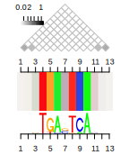
    
<code>TGAnTCA</code>

  </Card>

  <Card title="PWM-2">
    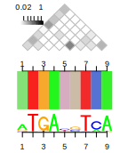
    
<code>TGAnnTCA</code>

  </Card>

  <Card title="BaMM">
    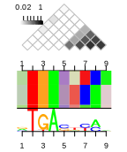
    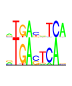
  </Card>

  <Card title="Slim">
    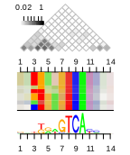
    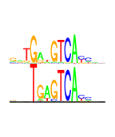
  </Card>

  <Card title="DIMONT">
    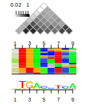
    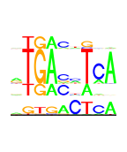
  </Card>
</CardGrid>

<FancyArrow
  v-if="$clicks === 1"
  from="(700, 190)"
  to="(645,225)"
  color="black"
  :width="3"
  :head-size="22"
  :roughness="1"
  :arc="-0.2"
  :duration="600"
/>

    pairwise positional dependencies

<FancyArrow
  v-if="$clicks === 2"
  from="(700, 190)"
  to="(645,320)"
  color="black"
  :width="3"
  :head-size="22"
  :roughness="1"
  :arc="-0.2"
  :duration="600"
/>

    site block representation

<FancyArrow
  v-if="$clicks === 3"
  from="(700, 195)"
  to="(645,390)"
  color="black"
  :width="3"
  :head-size="22"
  :roughness="1"
  :arc="-0.2"
  :duration="600"
/>

    logo

<Note>
Different motif models recover related AP-1/CRE-like signals, but represent site heterogeneity differently.
</Note>

<!--
Here are the discovered motifs visualized with DepLogo.
STREME returned two PWM motifs.
One motif has a one-base spacer, and the other has a two-base spacer in an AP-1/CRE-like pattern.

[click] For BaMM, DepLogo shows pairwise positional dependencies.

[click] The site block representation shows that sites can be grouped into different variants.

[click] The classical logo gives a more familiar summary of nucleotide preferences.

[click] The important point is that the models are related, but they represent heterogeneity differently.

[click] When we switch to the partition view, BaMM and Slim contain groups that correspond to both PWM spacer variants.
So one flexible model can cover what is split into two PWM motifs.
-->

---
---

## Pairwise comparison graph

<CardGrid :columns="2" style="min-height: 460px;">
    <Card title="Profile-based comparison (Cosine)" text="Compares the original motif models by their calibrated recognition profiles">
        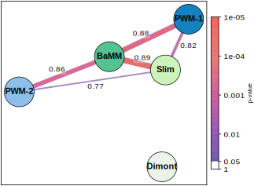
    </Card>
  <Card title="PFM-reconstruction comparison (PCC)" text="Motifs are summarized as PFMs reconstructed from predicted binding sites">
      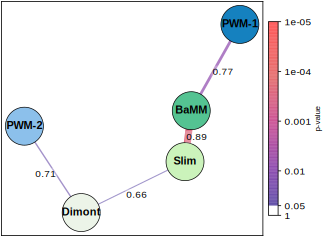
  </Card>
</CardGrid>

<Note>
By comparing recognition profiles, MIMOSA detects links that are partly lost after converting non-PWM models to PWMs.
</Note>

<!--
Here we compare the same five motifs in two ways.
The graph on the left uses profile-based comparison, so the original models are compared directly.
It connects BaMM and Slim with both PWM variants.
This suggests that the flexible models recognize both spacer variants.
The graph on the right uses PFMs reconstructed from predicted sites and then compares them by Pearson correlation.
Some links change, because reconstruction compresses a heterogeneous model into one matrix.
This is exactly the situation where profile-based comparison can keep more information.
-->

---
clicks: 3
---

## Site-level support

TFBSs were predicted for all motifs at $-\log_{10}(\mathrm{ERR}) = 3$; strand-matched coordinate overlaps were summarized with SuperVenn22

<FigurePanel
  src="assets/supervenn.png"
  alt="Supervenn site-overlap plot for ATF3 motif models"
  variant="wide"
/>

<Note v-click="1">
    PWM-1 and PWM-2 remain separated at the site level, whereas BaMM shares sites with both spacer variants: PWM-1 (1-bp spacer) and PWM-2 (2-bp spacer)

</Note>

<!--
Finally, we checked whether the model-level similarity is supported by predicted binding sites.
All models were thresholded at negative log ERR equal to three.

[click] PWM-1 and PWM-2 remain separated at the site level.
They do not form shared strand-matched overlap clusters.

[click] BaMM shares predicted sites with PWM-1, the one-base spacer variant.

[click] BaMM also shares predicted sites with PWM-2, the two-base spacer variant.
This supports the interpretation that BaMM integrates both spacer variants in one more flexible motif model.
-->

---
---

## Conclusion

  

    <ol>
      <li>MIMOSA compares <strong>recognition profiles</strong>, not motif parameters.</li>
      <li>It achieves retrieval performance close to strong established tools in a HOCOMOCO benchmark.</li>
      <li>It preserves model-specific recognition behavior, revealing when flexible models cover multiple PWM variants.</li>
    </ol>
    
<strong>Software:</strong>

    <ul>
      <li><a href="https://github.com/ubercomrade/mimosa">github.com/ubercomrade/mimosa</a></li>
      <li><a href="https://pypi.org/project/mimosa-tool/">pypi.org/project/mimosa-tool</a></li>
    </ul>
  

  <Card title="Repository">
    
    
Scan for GitHub repository

  </Card>

<Note>
This research was funded by the Russian Science Foundation, grant 25-74-00116.
</Note>

<!--
To conclude, MIMOSA compares recognition profiles rather than internal motif parameters.
In the HOCOMOCO benchmark, it performs close to established PWM-oriented tools.
In the ATF3 case study, it helps show that flexible models can cover several PWM variants.
The software is available on GitHub and PyPI.
This research was funded by the Russian Science Foundation.
Thank you for your attention.
-->
---
class: references-slide
---

## References

<ol class="references-list">
  <li>Lambert S.A. et al. The human transcription factors. <em>Cell</em>, 2018. doi:10.1016/j.cell.2018.01.029</li>
  <li>Wasserman W.W., Sandelin A. Applied bioinformatics for the identification of regulatory elements. <em>Nature Reviews Genetics</em>, 2004. doi:10.1038/nrg1315</li>
  <li>Berg O.G., von Hippel P.H. Selection of DNA binding sites by regulatory proteins. <em>Journal of Molecular Biology</em>, 1987. doi:10.1016/0022-2836(87)90354-8</li>
  <li>Bulyk M.L. et al. Interdependent effects of nucleotides in TF binding sites. <em>Nucleic Acids Research</em>, 2002. doi:10.1093/nar/30.5.1255</li>
  <li>Cooper D.J. et al. Comprehensive analysis of nucleotide dependencies in TF binding sites. <em>Nucleic Acids Research</em>, 2023.</li>
  <li>Amoutzias G.D. et al. Choose your partners: dimerization in eukaryotic TFs. <em>Trends in Biochemical Sciences</em>, 2008. doi:10.1016/j.tibs.2008.02.002</li>
  <li>Levo M. et al. Determinants of TF binding outside the core binding site. <em>Genome Research</em>, 2015. doi:10.1101/gr.185033.114</li>
  <li>Morgunova E., Taipale J. Structural insights into TFBS recognition. <em>Current Opinion in Structural Biology</em>, 2017. doi:10.1016/j.sbi.2017.09.003</li>
  <li>Siebert M., Soding J. Bayesian Markov models outperform PWMs at motif prediction. <em>Nucleic Acids Research</em>, 2016. doi:10.1093/nar/gkw521</li>
  <li>Keilwagen J., Grau J. Varying levels of complexity in TF binding motifs. <em>Nucleic Acids Research</em>, 2015. doi:10.1093/nar/gkv577</li>
  <li>Grau J. et al. A general approach for discriminative de novo motif discovery. <em>Nucleic Acids Research</em>, 2013. doi:10.1093/nar/gkt831</li>
  <li>Gupta S. et al. Quantifying similarity between motifs. <em>Genome Biology</em>, 2007. doi:10.1186/gb-2007-8-2-r24</li>
  <li>Mahony S., Benos P.V. STAMP: exploring DNA-binding motif similarities. <em>Nucleic Acids Research</em>, 2007. doi:10.1093/nar/gkm272</li>
  <li>Vorontsov I.E. et al. Jaccard index based comparison of TFBS models. <em>Algorithms for Molecular Biology</em>, 2013. doi:10.1186/1748-7188-8-23</li>
  <li>Tsukanov A.V. et al. Independent and interdependent nucleotide impacts in motif models. <em>Frontiers in Plant Science</em>, 2022. doi:10.3389/fpls.2022.938545</li>
  <li>Costa L. da F. On similarity. <em>Physica A</em>, 2022. doi:10.1016/j.physa.2022.127456</li>
  <li>Vorontsov I.E. et al. HOCOMOCO v12: transcription factor binding models. <em>Nucleic Acids Research</em>, 2024.</li>
  <li>Wingender E. et al. TFClass: classification of human TFs and mammalian orthologs. <em>Nucleic Acids Research</em>, 2018. doi:10.1093/nar/gkx987</li>
  <li>Santana-Garcia G. et al. MoSBAT 2.0. <em>Nucleic Acids Research</em>, 2022. doi:10.1093/nar/gkac333</li>
  <li>Kolmykov S. et al. GTRD: an integrated view of transcription regulation. <em>Nucleic Acids Research</em>, 2021. doi:10.1093/nar/gkaa1057</li>
  <li>Grau J. et al. DepLogo: visualizing sequence dependencies in R. <em>Bioinformatics</em>, 2019. doi:10.1093/bioinformatics/btz507</li>
  <li>Indukaev F. gecko984/supervenn: v0.5.0. <em>Zenodo</em>, 2024. doi:10.5281/zenodo.11395173</li>
</ol>

<!--
I will not present the references during the main 10 to 12 minute talk.
This slide is here if there are questions about sources.
-->

---
layout: section
class: section-divider
---

<Eyebrow>Backup</Eyebrow>

# Additional details

<!--
This starts the backup section.
I will move here only if there is time or if there is a specific question.
-->

---
---

## ERR calibration and null

- ERR estimates how often a model produces a score at least this high.15
- `-log10(ERR)` puts different score scales into one coordinate system.
- Shuffled HOCOMOCO motifs define empirical background similarity.17
- FDR controls multiple testing in benchmark and case-study comparisons.

<!--
Use this slide if someone asks about score calibration or statistical support.
ERR means expected recognition rate.
The negative log ERR scale helps compare scores from different model types.
For significance, we used shuffled HOCOMOCO motifs as an empirical null distribution, and FDR correction controlled multiple testing.
-->

---
---

## Ranking concordance

<FigurePanel
  src="assets/Kendall_heatmap.png"
  alt="Kendall concordance heatmap for motif-comparison rankings"
  variant="tall"
/>

<Note>
Different tools rank the full target list differently, even when retrieval accuracy is close.
</Note>

<!--
Use this slide if someone asks whether MIMOSA produces the same rankings as existing tools.
The answer is partly yes and partly no.
The correlations are positive, but they are not perfect.
This means different tools emphasize different aspects of motif similarity, especially for weaker candidates.
-->

---
---

## Annotation details: reciprocal rank

<FigurePanel
  src="assets/annotation_rr_tf_level.png"
  alt="Reciprocal-rank annotation details at TF level"
  variant="tall"
/>

<!--
Use this slide if someone asks about ATF3 database matching ranks.
Higher reciprocal rank means that the ATF3-compatible database match appears closer to the top.
The main message is that profile-based comparison supports AP-1/CRE-like, ATF3-compatible annotation for PWM, BaMM, and Slim models.
-->

---
---

## Annotation details: significance

<FigurePanel
  src="assets/annotation_significance_tf_level.png"
  alt="Significance annotation details at TF level"
  variant="tall"
/>

<!--
Use this slide if someone asks about statistical significance of ATF3 matches.
The y-axis shows adjusted significance values.
The dashed line marks the FDR threshold.
This helps separate strong ATF3-compatible matches from weaker or divergent cases.
-->

---
---

## Profile alignment: PWM-1 vs PWM-2

<FigurePanel
  src="assets/compare_profiles_PWM-1_vs_PWM-2.png"
  alt="Profile alignment comparing PWM-1 and PWM-2"
  variant="wide"
/>

<!--
Use this slide to explain why PWM-1 and PWM-2 are treated as separate spacer variants.
When we anchor on sites from one PWM, the other PWM has a weak profile.
This means that the two PWM models recognize different subsets of AP-1/CRE-like sites.
-->

---
---

## Profile alignment: PWM-1 vs BaMM

<FigurePanel
  src="assets/compare_profiles_PWM-1_vs_BaMM.png"
  alt="Profile alignment comparing PWM-1 and BaMM"
  variant="wide"
/>

<!--
Use this slide to show that BaMM recognizes the PWM-1 spacer variant.
Around PWM-1 anchor sites, BaMM has a strong aligned profile.
When anchoring on BaMM sites, PWM-1 captures only part of the BaMM signal, because BaMM also recognizes another spacer variant.
-->

---
---

## Profile alignment: PWM-2 vs BaMM

<FigurePanel
  src="assets/compare_profiles_PWM-2_vs_BaMM.png"
  alt="Profile alignment comparing PWM-2 and BaMM"
  variant="wide"
/>

<!--
Use this slide to show the same pattern for PWM-2.
BaMM also recognizes the two-base spacer variant.
Together with the previous slide, this explains why BaMM is similar to both PWM motifs in profile-based comparison.
-->
